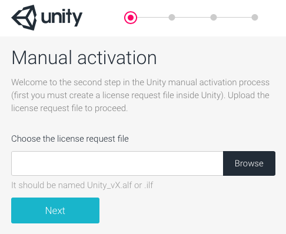
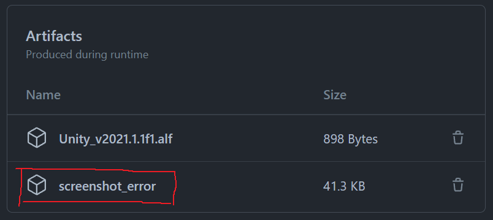

[](https://opensource.org/licenses/Apache-2.0)
[](https://david-dm.org/jcs090218/unity-license-activate)

# unity-license-activate
> A tool to automate the manual activation of unity license using puppeteer

This is a fork from [MizoTake/unity-license-activate](https://github.com/MizoTake/unity-license-activate).

This tool is design to use with [GameCI](https://game.ci/) and personal license
(free version) users. Personal license will expire after some times, then you most
likely would have to repeast the step [Activation - Personal License](https://game.ci/docs/github/activation#personal-license)
in order to keep the CI running. Thankfully, you can use this tool to constantly
activate a new license from Unity's licensing system.

<p align="center">
  
</p>

## 🔨 How to use?

You can use this tools with any CI/CD system as long as you have the [Node](https://nodejs.org/en/)
environment set up! Here is an example for GitHub Actions.

```yml
jobs:
  acquire_ulf:
    name: Acquire .ulf file 🔑
    runs-on: ubuntu-latest
    strategy:
      matrix:
        node-version: [14.x]
    steps:
      - name: Set up Node.js ${{ matrix.node-version }}
        uses: actions/setup-node@v1
        with:
          node-version: ${{ matrix.node-version }}

      - name: Install node package, `unity-license-activate`
        run: npm install --global unity-license-activate

      - name: Activate the license
        run: unity-license-activate "${{ secrets.UNITY_EMAIL }}" "${{ secrets.UNITY_PASSWORD }}" "${{ needs.request_alf.outputs.alf }}"

      - name: Read ulf
        id: ulfRead
        uses: juliangruber/read-file-action@v1.1.4
        with:
          path: ${{ env.ULF_FILE }}

      - name: Update secret UNITY_LICENSE
        uses: hmanzur/actions-set-secret@v2.0.0
        with:
          name: 'UNITY_LICENSE'
          value: '${{ steps.ulfRead.outputs.content }}'
          token: ${{ secrets.ACCESS_TOKEN }}
```

See the full example [here](https://github.com/jcs090218/JCSUnity/blob/master/.github/workflows/license.yml).

## 🔐 Two Factor Authentication (TFA)

Unity requires you to enter a 6 digit verification code from your email. To get
pass this, you would have to install [unity-verify-code](https://github.com/jcs090218/unity-verify-code)
in your workflow and follow the steps [here](https://github.com/jcs090218/unity-verify-code#-prerequisite)
(IMAP).

```yml
      - name: Install node package, `unity-verify-code`
        run: npm install --global unity-verify-code
```

If you have different password from Unity account and Email account, you would
need to add `--password` flag to it.

```yml
      - name: Activate the license
        run: unity-license-activate ... --password "${{ secrets.EMAIL_PASSWORD }}"
```

## ㊙️ Secrets

You should have 3 ~ 4 GitHub secrets to correctly set up the entire workflow.

* `UNITY_EMAIL` - Email address that you use to login to Unity
* `UNITY_PASSWORD` - Password that you use to login to Unity
* `ACCESS_TOKEn` - Use to update secret `UNITY_LICENSE`, see https://github.com/hmanzur/actions-set-secret#token
* `EMAIL_PASSWORD` (optional) - Use to get pass Unity's Two Factor Authentication
system, `UNITY_PASSWORD` is used by default assuming your email password is the same.

## 🩺 Error handling

For some reason, if this plugin does not work. Try configure your workflow file
like this,

```yml
      - name: Activate the license
        continue-on-error: true        # Add this line to get pass the error flag
        run: unity-license-activate "${{ secrets.UNITY_EMAIL }}" "${{ secrets.UNITY_PASSWORD }}" "${{ needs.request_alf.outputs.alf }}"

      # Add the error handling step here!
      - name: 🩺 Upload error screenshot
        uses: actions/upload-artifact@v1
        with:
          name: screenshot_error
          path: error.png
```

The program generates a `error.png` file if something went wrong. Then you can
download and see what's the last step before the program is exited.

<p align="center">
  
</p>

## 📇 Command Line Arguments

```console
usage : unity-license-activate EMAIL [EMAIL ...] PASSWORD [PASSWORD ...] ALF [ALF ...]

Unity License Activate : Activate Unity license through CLI.

positional arguments:
  EMAIL          Username or Email you use to register for Unity account
  PASSWORD       Password to login Unity account
  ALF            Unity activation license file path
```

## 🔗 Links

* https://license.unity3d.com/manual
